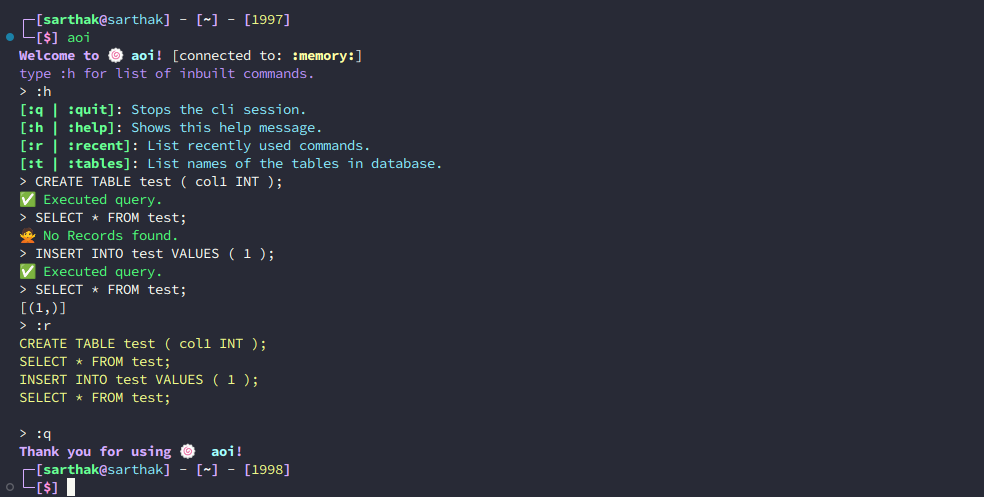

# 🍥 aoi
<p>


<p>
A simple python based sqlite3 CLI.

```sh
$python -m pip install aoi
```
---

## Usage 
```sh
$aoi [-c "path to connect"]
# if the above fails try executing using full python path. ( read note below image. )
$python -m aoi [-c "path to connect"]
```
using the -c/--connect option will connect the application to the provided db file path.

If no option is provided, `:memory:` ( in memory database ) will be used.

## Additional Features

Apart from normal sqlite queries you can run the following commands within the CLI:

`:h/:help`: Get help for commands.

`:q/:quit`: Exit the CLI.

`:r/:recent [amount=5]`: Show last [amount=5] queries.

`:t/:tables`: Shows the tables inside the database





### NOTE
The `aoi` command may fail if the executeable's path wasn't added to the terminal's/system's PATH, however running the library as a module ( `python -m aoi` ) will always work as long as python is added to path.

---
## Installation
* Requires Python (3.8 or later)

Installing aoi in your environment using pip, poetry or any favourable package manager
```sh
# pip
$pip install aoi # from pypi
$python -m pip install git+https://github.com/sarthhh/aoi.git # from source
# poetry
$poetry add aoi # from pypi
$poetry add git+https://github.com/sarthhh/aoi.git # from source
```